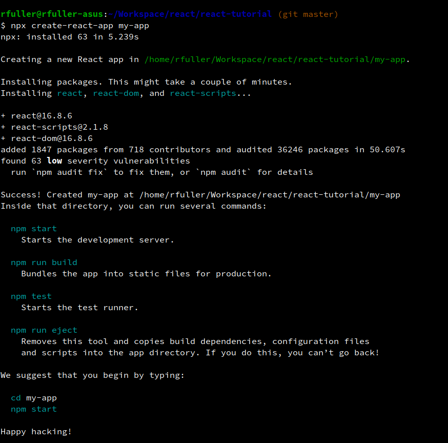

# Intro to React Tutorial 

## Description
This repositority will hold the artifacts that I create as I start to learn React. I'm going to kick off my study of React by starting with the React tutorial on the Reactjs website, which can be found [here](https://reactjs.org/tutorial/tutorial.html). I"m going to use this readme to keep track of my thoughts and things that stand out to me as I start on this journey. 

## Installation and Usage
** Clone or download this package from github. install the package.json then cd into the app folder. You can then run `npm start`. The application will launch on port 3000.

### April 7th - Setup for tutorial
According to the React tutorial, you can either follow along in the browser or setup a local development environment. I choose to setup a local environment. You basically scaffold a 'Hello World' app by running `npx create-react-app <app-name>`. This gives you a scaffolded app that you can run by then using the `npm start` command from inside your app folder. Your app will start on localhost 3000. 

One thing that happened that derailed me for over an hour was that after starting the app using `npm start` which basically runs react-scripts start.js, I noticed that my console was cleared. This was really annoying to me as I often refer back to commands I've used in the console, especially when I am learning something. And when I say the console was cleared, I mean, all of it. I eventually tracked this down to node-modules/react-scripts/scripts/start.js. Inside of that file is a function to clear the console. At first I thought it would be best to comment this out, but then I realized that before you start the app, you can first launch a second/new terminal and start it from there. I"m not sure why react/facebook made a decision that the console should be cleared when you start the react app but at least there is a workaround. 

### April 9th - React Components, props, immutability
Some of the things I took from this tutorial
1. React Components are subclasses
2. Components take in parameters called `props` for properties
3. `render()` returns a React element
4. in JSX, put javascript between curly braces `{ }`
5. Each React element is a JS object that you can assign, pass around, etc.
6. Information flows in react by passing props from parent to child components
7. React components have state by setting `this.state` in their constructor
8. To collect data from multiple children or to have child components communicate with each other, declare the state in the parent component instead of the children. Let the parent communicate the state with the children by using props. This will keep the children in-synch with each other and with the parent component.
9. Importance of immutability. Instead of chaning data directly, it's a better practice to take a copy and then modify the copy. 
    ..- Makes complex features simple, such as a feature to view history or revert changes. 
    ..- Makes detecting changes easier to determine when to update state